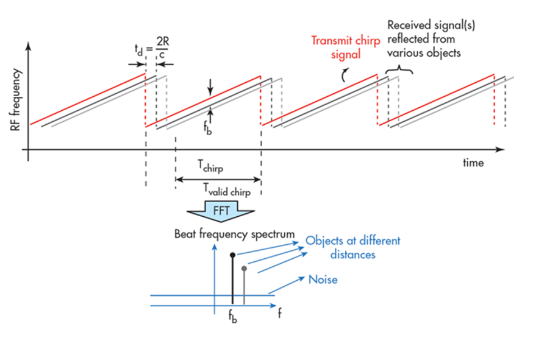

# SFND Radar Target Generation and Detection
#### Udacity Sensor Fusion Nanodegree 
Configuring the radar FMCW waveform based on the system requirements and simulating the radar signal propagation and moving target scenario. Finally, post processing the radar signal using 1st FFT, 2nd FFT, and CA-CFAR to estimate the target's range and velocity.
___
### Project Flow Chart


---
### 1. Radar Specifications 
* Frequency of operation = 77GHz
* Max Range = 200 m
* Range Resolution = 1 m
* Max Velocity = 100 m/s
* Light Speed = 3e8 m/s

### 2. User Defined Range and Velocity of the simulated target

* Target Initial Range = 100 m
* Target Velocity = 50 m/s


### 3. FMCW Waveform Generation
The FMCW waveform design:
* carrier frequency = 77 GHz
* The Bandwidth (B) = speed_of_light / (2 * Range_Resolution_of_Radar) = 150 MHz
* Chirp Time (Tchirp) =  (sweep_time_factor(should be at least 5 to 6) * 2 * Max_Range_of_Radar) / speed_of_light = 7.333 μs
* Slope of the FMCW chirp = B / Tchirp = 2.045e+13
* The number of chirps in one sequence (Nd) = 128
* The number of samples on each chirp (Nr) =1024 

### 4. Signal generation and Moving Target simulation


### 5. Range Measurement
Applying the Fast Fourier Transform on the sampled beat signal to convert the signal from time domain to frequency domain and hence know the range between the target and the radar.
<p align="center">
  
</p>

* Simulation Result


### 6. Range Doppler Response
Applying the 2D FFT on the beat signal where the output of the first FFT gives the beat frequency, amplitude, and phase for each target. This phase varies as we move from one chirp to another due to the target’s small displacements. Once the second FFT is implemented it determines the rate of change of phase, which is nothing but the doppler frequency shift (Velocity of the targets). The output of Range Doppler response represents an image with Range on one axis and Doppler on the other. This image is called as Range Doppler Map (RDM).

* Simulation Result


### 7. CA-CFAR implementation
Applying the 2d CA-CFAR on the RDM outputed from 2D FFT to filter out the noise. As, CFAR varies the detection threshold based on the vehicle surroundings.

#### CA-CFAR algorithm:
1. Determine the number of Training cells for each dimension. Similarly, pick the number of guard cells.
2. Slide the cell under test across the complete matrix. Make sure the Cell Under Test (**CUT**) has margin for Training and Guard cells from the edges.
3. For every iteration sum the signal level within all the training cells after converting the value of the cells from logarithmic to linear using db2pow function.
4. Average the summed values for all of the training cells used. After averaging convert it back to logarithmic using pow2db.
5. Further add the offset to it to determine the threshold.
6. Next, compare the signal under CUT against this threshold.
7. If the CUT level > threshold assign the filtered signal a value of 1.

**Note:** The process above will generate a thresholded block, which is smaller than the range doppler map as the CUTs cannot be located at the edges of the matrix due to the presence of Target and Guard cells. Hence, those cells will not be thresholded. To keep the map size same as it was before CA-CFAR, the filtered signal variable is instantiated as a matrix with size equals to the range doppler map size and with all its elements equal to 0: ```zeros(Nr/2,Nd)``` .

#### Sliding Window Design:
<p align="center">
  
</p>

* Training Cells Columns = 10 cells
* Training Cells Rows = 8 cells
* Guard Cells Columns = 2 cells
* Guard Cells Rows = 4 cells
* Threshold Factor (Offset) = 10 dB

<br>

* Simulation Result

